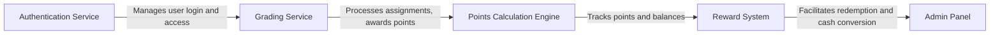

# C4 Architectural Diagrams (ARCHITECTURE.md)

## 1. Context Diagram
The **Gradebook Points System** is an educational platform that tracks student performance and rewards points that can be converted into money. Below is a high-level view of how different users and systems interact with the application.

```mermaid
graph TD
    A[Students] -->|Use system to complete tasks and redeem points| B[Frontend (Web/Mobile App)]
    C[Teachers] -->|Upload grades, verify task completion| B
    D[Admins] -->|Oversee platform, manage users, ensure reward distribution| B
    B --> E[Backend (API Server)]
    E --> F[Database]
    E --> G[Payment System]
    E --> H[External Educational APIs]
    G -->|Handles conversion of points into money| I[Payment Gateway]
    H -->|Fetches grading data, integrates with LMS| J[External Educational APIs]

```
## 2. Container Diagram
The system consists of several containers that communicate with each other.

```mermaid
graph TB
    A[Frontend] -->|Displays student progress, reward points| B[Backend (API Server)]
    B -->|Handles authentication, grading logic, and point conversion| C[Database]
    B -->|Exposes APIs for frontend and external systems| D[Payment Gateway]
    B -->|Connects with external educational systems| E[External APIs]
    D -->|Processes point-to-money conversion| F[Payment System]
    E -->|Fetches grading data| G[External Educational APIs]

```
## 3. Component Diagram
The key components include the following.


