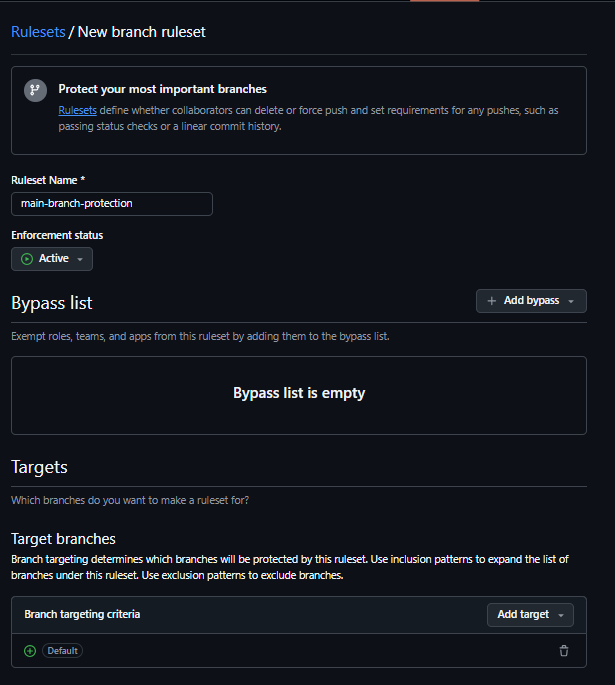
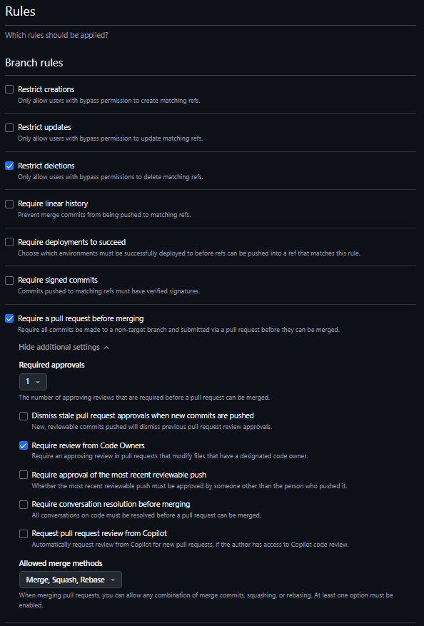
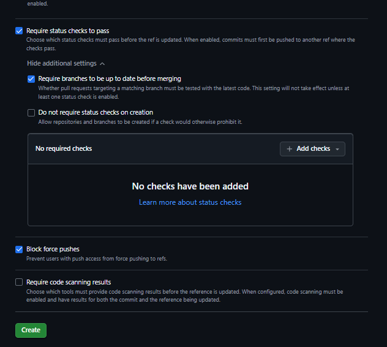

**Branch Protection Rules for main branch Explanation**
To maintain code quality and ensure collaboration best practices, the following branch protection rules have been applied to the main branch:

1) Require Pull Request Reviews
- Each and every code change must be reviewed by at least one team member before merging, in this case I made the owner of the code the person to review any changes. This will reduce any bugs by a large amount, and this also encourages knowledge sharing amoungst the team members. Another benefit to having PR reviews is that it promotes accountability in the development process of applications or systems.

2) Require Status Checks to Pass
- Requiring automated tests to pass before changes are merged is to prevent code from breaking or broken code entering the current code. This ensures there is consistency and stability in the code.

3) Disable Direct Pushes
- Developers are not able to push their code directly to the main branch. The changes they want to add needs to go through a pull request (PR). This will enforce peer review and CI checks, it also protects the integrity of production-ready code.

**Branch Rules**

