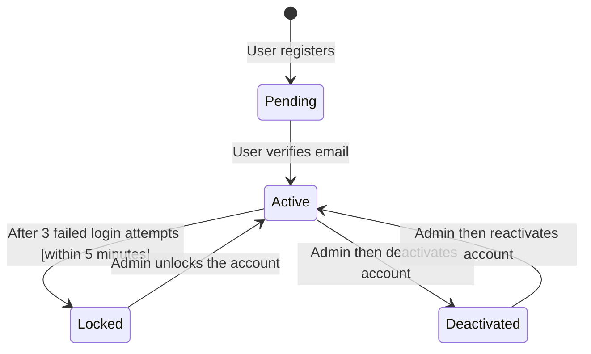
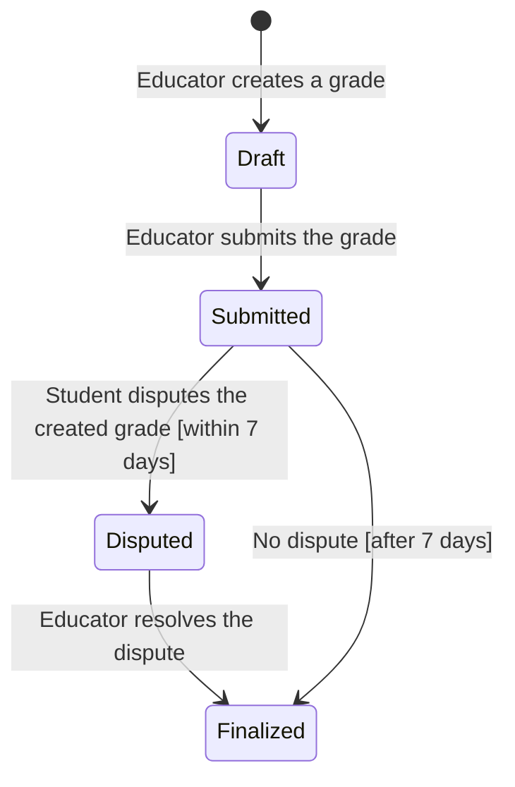
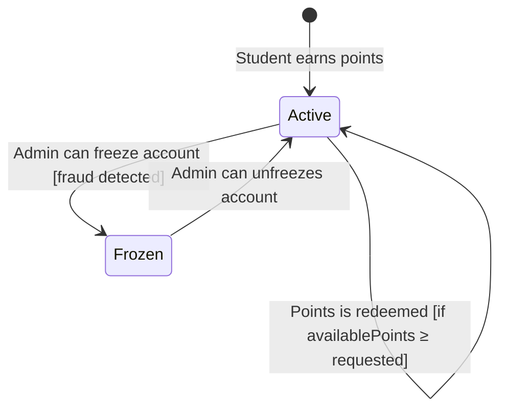
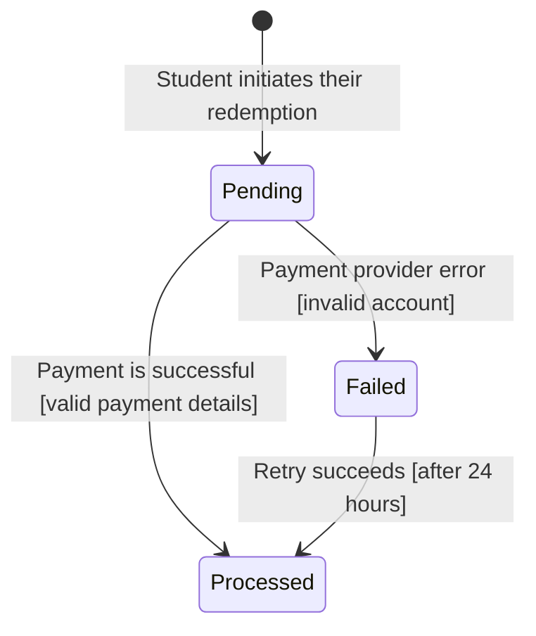
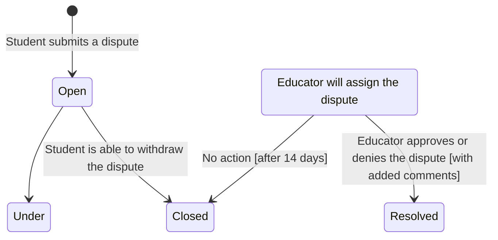
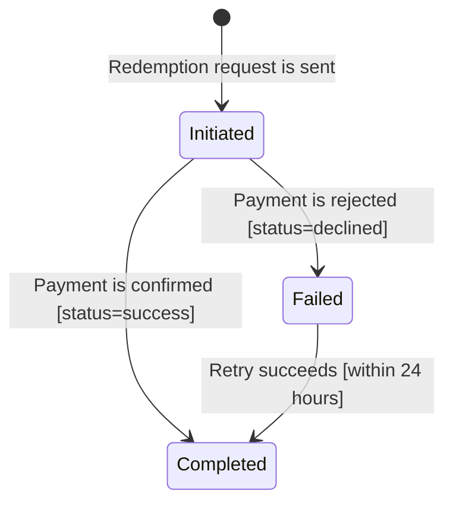
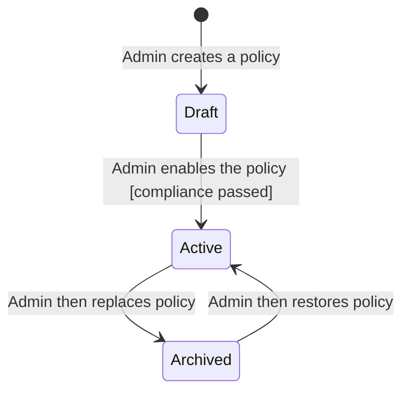
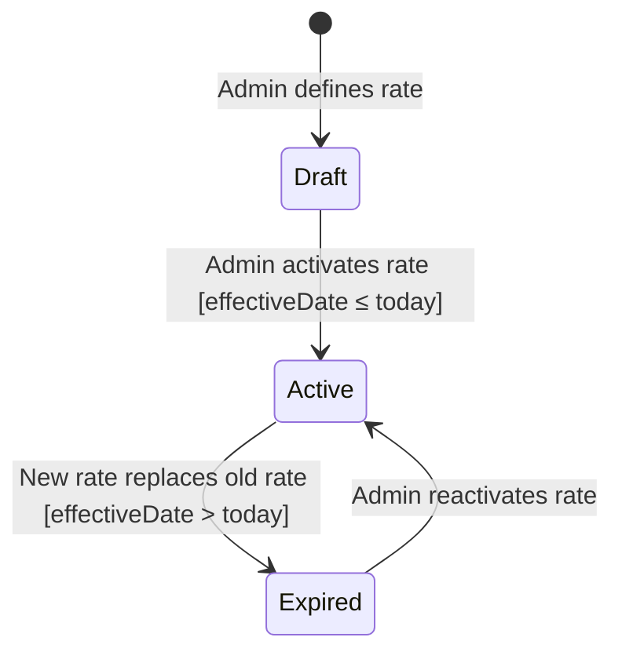

**State Transition Diagrams**

*User*

```mermaid
stateDiagram-v2
    [*] --> Pending: User registers
    Pending --> Active: User verifies email
    Active --> Locked: After 3 failed login attempts [within 5 minutes]
    Locked --> Active: Admin unlocks the account
    Active --> Deactivated: Admin then deactivates account
    Deactivated --> Active: Admin then reactivates account
```
*Grade*

```mermaid
stateDiagram-v2
    [*] --> Draft: Educator creates a grade
    Draft --> Submitted: Educator submits the grade
    Submitted --> Disputed: Student disputes the created grade [within 7 days]
    Disputed --> Finalized: Educator resolves the dispute
    Submitted --> Finalized: No dispute [after 7 days]
```
*Points Balance*

```mermaid
stateDiagram-v2
    [*] --> Active: Student earns points
    Active --> Active: Points is redeemed [if availablePoints ≥ requested]
    Active --> Frozen: Admin can freeze account [fraud detected]
    Frozen --> Active: Admin can unfreezes account
```
*Rewards Redemption*

```mermaid
stateDiagram-v2
    [*] --> Pending: Student initiates their redemption
    Pending --> Processed: Payment is successful [valid payment details]
    Pending --> Failed: Payment provider error [invalid account]
    Failed --> Processed: Retry succeeds [after 24 hours]
```
*Dispute*

```mermaid
stateDiagram-v2
    [*] --> Open: Student submits a dispute
    Open --> Under Review: Educator will assign the dispute
    Under Review --> Resolved: Educator approves or denies the dispute [with added comments]
    Open --> Closed: Student is able to withdraw the dispute
    Under Review --> Closed: No action [after 14 days]
```
*Transaction*

```mermaid
stateDiagram-v2
    [*] --> Initiated: Redemption request is sent
    Initiated --> Completed: Payment is confirmed [status=success]
    Initiated --> Failed: Payment is rejected [status=declined]
    Failed --> Completed: Retry succeeds [within 24 hours]
```
*Security Policy*

```mermaid
stateDiagram-v2
    [*] --> Draft: Admin creates a policy
    Draft --> Active: Admin enables the policy [compliance passed]
    Active --> Archived: Admin then replaces policy
    Archived --> Active: Admin then restores policy
```
*Redemption Rate*

```mermaid
stateDiagram-v2
    [*] --> Draft: Admin defines rate
    Draft --> Active: Admin activates rate [effectiveDate ≤ today]
    Active --> Expired: New rate replaces old rate [effectiveDate > today]
    Expired --> Active: Admin reactivates rate
```