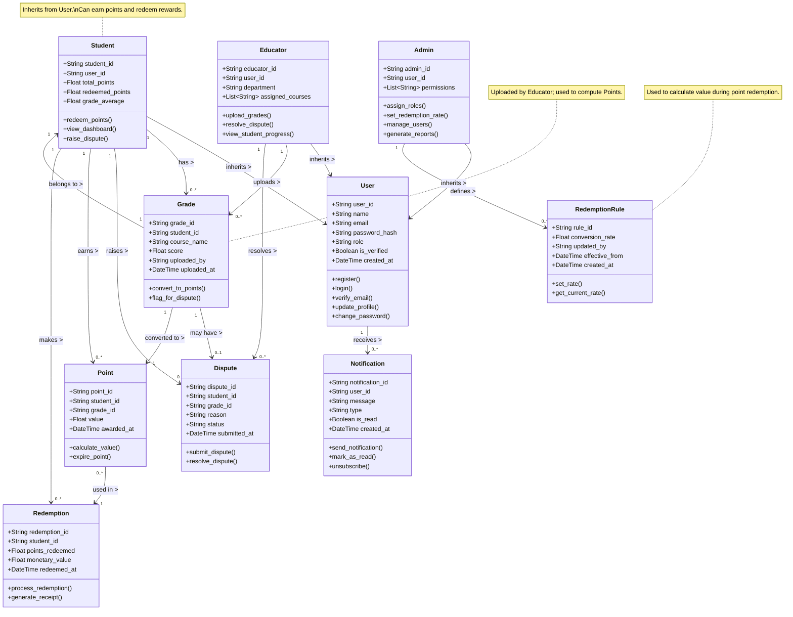

```mermaid
classDiagram
    class User {
        +String user_id
        +String name
        +String email
        +String password_hash
        +String role
        +Boolean is_verified
        +DateTime created_at
        +register()
        +login()
        +verify_email()
        +update_profile()
        +change_password()
    }

    class Student {
        +String student_id
        +String user_id
        +Float total_points
        +Float redeemed_points
        +Float grade_average
        +redeem_points()
        +view_dashboard()
        +raise_dispute()
    }

    class Educator {
        +String educator_id
        +String user_id
        +String department
        +List~String~ assigned_courses
        +upload_grades()
        +resolve_dispute()
        +view_student_progress()
    }

    class Admin {
        +String admin_id
        +String user_id
        +List~String~ permissions
        +assign_roles()
        +set_redemption_rate()
        +manage_users()
        +generate_reports()
    }

    class Grade {
        +String grade_id
        +String student_id
        +String course_name
        +Float score
        +String uploaded_by
        +DateTime uploaded_at
        +convert_to_points()
        +flag_for_dispute()
    }

    class Point {
        +String point_id
        +String student_id
        +String grade_id
        +Float value
        +DateTime awarded_at
        +calculate_value()
        +expire_point()
    }

    class Redemption {
        +String redemption_id
        +String student_id
        +Float points_redeemed
        +Float monetary_value
        +DateTime redeemed_at
        +process_redemption()
        +generate_receipt()
    }

    class Dispute {
        +String dispute_id
        +String student_id
        +String grade_id
        +String reason
        +String status
        +DateTime submitted_at
        +submit_dispute()
        +resolve_dispute()
    }

    class Notification {
        +String notification_id
        +String user_id
        +String message
        +String type
        +Boolean is_read
        +DateTime created_at
        +send_notification()
        +mark_as_read()
        +unsubscribe()
    }

    class RedemptionRule {
        +String rule_id
        +Float conversion_rate
        +String updated_by
        +DateTime effective_from
        +DateTime created_at
        +set_rate()
        +get_current_rate()
    }

Student --> User : inherits >
Educator --> User : inherits >
Admin --> User : inherits >

Student "1" --> "0..*" Grade : has >
Educator "1" --> "0..*" Grade : uploads >
Grade "1" --> "1" Student : belongs to >

Grade "1" --> "0..1" Dispute : may have >
Student "1" --> "0..*" Dispute : raises >
Educator "1" --> "0..*" Dispute : resolves >

Grade "1" --> "1" Point : converted to >
Student "1" --> "0..*" Point : earns >

Student "1" --> "0..*" Redemption : makes >
Point "0..*" --> "1" Redemption : used in >

Admin "1" --> "0..*" RedemptionRule : defines >

User "1" --> "0..*" Notification : receives >

note for Student "Inherits from User.\nCan earn points and redeem rewards."
note for Grade "Uploaded by Educator; used to compute Points."
note for RedemptionRule "Used to calculate value during point redemption."

```